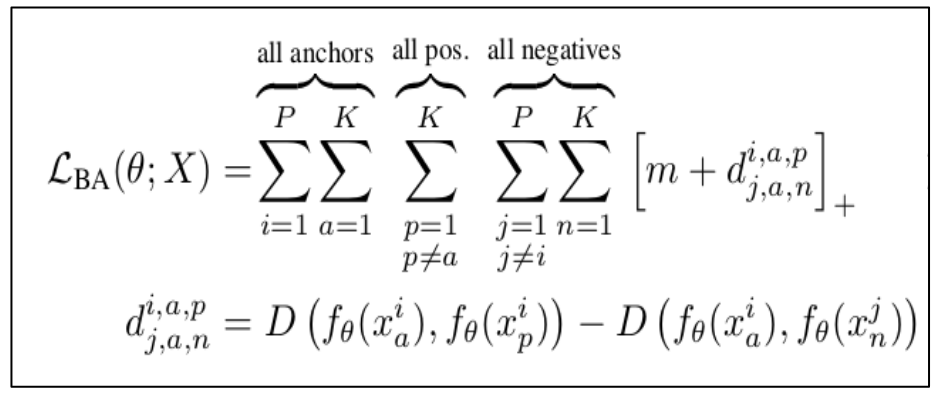

# person_reid_batchall

A triplet network takes in three images as input i.e., an anchor image, a positive image (i.e., image having label same as the anchor) and a negative image (i.e., image having label different from the anchor). The objective here is to learn embeddings such that the positive images are closer to the anchor as compared to the negative images. 

The Batch All variant of the triplet loss is mathematically expressed as: 
</img>

Source: <a href = "https://arxiv.org/abs/1703.07737">Alexander Hermans, Lucas Beyer, Bastian Leibe, “In Defense of the Triplet Loss for Person Re-Identification”</a> 

### Dataset

The dataset on which this model has been trained is <b>Market-1501</b>. Dataset description can be found on <a href = "https://www.aitribune.com/dataset/2018051063">this link</a>. The dataset can be downloaded from the kaggle website.

### Network Architecture and Data Augmentation
The network architecture used is: 
<i>Pretrained ResNet-50 > Linear 1024 > BatchNorm > ReLU > Linear 128</i> 
The dataset is augmented on the go (during training) by using Random Horizontal Flips. 

### Tensorboard Visualization

The training logs obtained are as follows: 
<b>Batch All with Hard Margin:</b> 
</img>
<b>Batch All with Soft Margin:</b> 
</img>

Moreover the training logs can be visualized by following instructions as: 
1) Go to the source directory. 
2) Type the command: 
For Batch All with Hard Margin: 
<code>$ tensorboard --logdir logs_market1501_batchall</code> 
For Batch All with Soft Margin: 
<code>$ tensorboard --logdir logs_market1501_batchall_softplus</code> 
3) Go to a browser and type: 
<code>http://localhost:6006/</code>

### Performance Evaluation
The performance evaluation code is taken from <a href = "https://github.com/VisualComputingInstitute/triplet-reid">this repository</a>. 
The results are summarized in the table below: 

<b>Batch All with Hard Margin:</b>
|mAP|top-1|top-2|top-5|top-10|
|---|-----|-----|-----|------|
|30.89%|52.61%|63.06%|75.86%|83.94%|

<b>Batch All with Softplus:</b>
|mAP|top-1|top-2|top-5|top-10|
|---|-----|-----|-----|------|
|31.50%|49.11%|60.66%|74.58%|83.31%|

### Weights
The weights obtained using this repository can be downloaded using the following links: 
<b>Batch All with Hard Margin:</b> 
https://drive.google.com/file/d/1ct86ToFBhcRbYQI9e-XFOzgjEJ_QmYgt/view?usp=sharing 
<b>Batch All with Softplus:</b> 
https://drive.google.com/file/d/15sopJZNrzWaVs_RnBqdDnYeMKK7ju6Cz/view?usp=sharing
